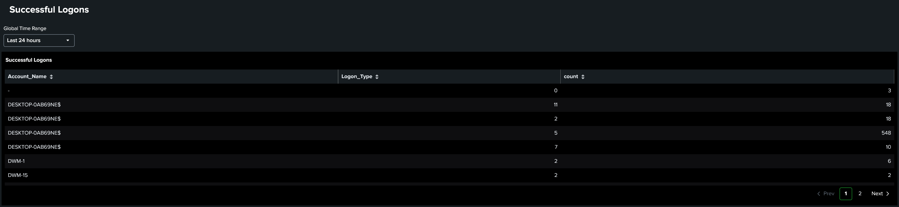
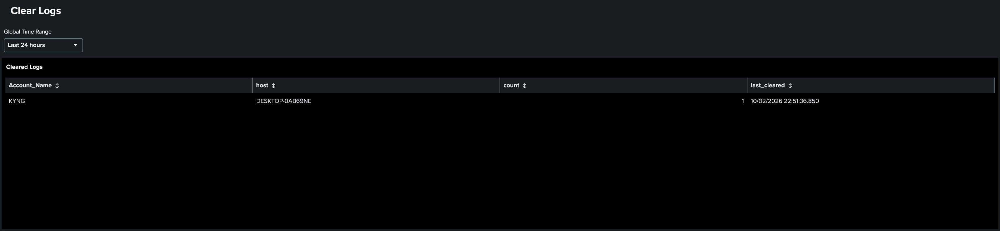

# Home SIEM Lab

A small SIEM for my home network, built with **Splunk Enterprise**, to practice monitoring Windows security events that matter in enterprise environments.

## Overview
- **SIEM**: Splunk Enterprise on Windows
- **Log source:** Windows Event Logs from my desktop via local input
- **Focus:** Authentication monitoring (successful logons) and detection of audit log tampering

## Detections
| Event ID | Meaning | Why it matters |
|----------|---------|----------------|
| 1102 | Security audit log cleared | Attackers often clear logs to hide their activity; this should rarely happen on a healthy system |
| 4624 | Successful logon | Helps spot unusual accounts, logon types, or times |

The SPL searches are in [`/queries`](queries/).

## Dashboards
**Successful logons**

**Cleared logs**

## What I learned
- How Windows logs authentication events and how to search them with SPL
- How to turn a search into a dashboard panel

## Next steps
- Add more log sources (e.g., Sysmon, router syslog) as well as including more machines than the local host
- Create an alert that fires when a log clear (1102) is detected
- Test detections with safe simulated activity
